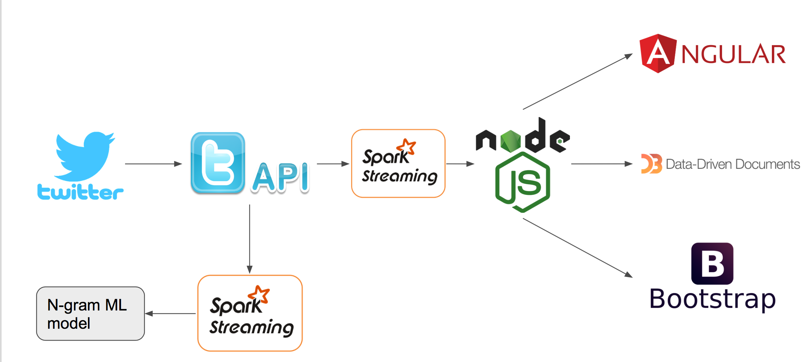

# Dynamic-Word-Cloud-Generator
  * We designed a dynamic word-cloud generator, which is able to fetching real-time tweets through tweepy API, do word-counting and generate word cloud accordingly. This word cloud generator can also monitoring real-time politic point-of-view on twitter, and see which voice is stronger - the left-wing and the right-wing.
  
## Topology



## Requirements
#### General
  * Python >= 3.6
#### Python Packages
  * tweepy == 3.6.0
  * pyspark == 2.3.0
  * nltk == 3.2.5

## Usage

#### Word-Cloud Generator Usage

First you should run tweepy_app.py, which fetches tweets from Twitter, with a specific port number. For example, if you would like to run it on port 9001, do

```bash
python tweepy_app.py 9001
```

Then you should run spark_app_wordcloud.py which listens to sockets from tweepy_app in a different CLI window. Make sure you listen to the same port of tweepy_app 

```bash
python spark_app_wordcloud.py 9001
```

Now you can start the server with the following command in another CLI window, and then visit http://localhost:3002.

```bash
node server.js
```

#### Politic Point-Of-Views monitoring

Train the model by simply running the following command:

```bash
python model.py
```

Start tweet_app in a CLI window, and then, launch spark_app_politics.py

```bash
python spark_app_politics.py <your_port_number>
```

